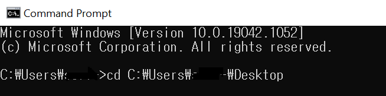
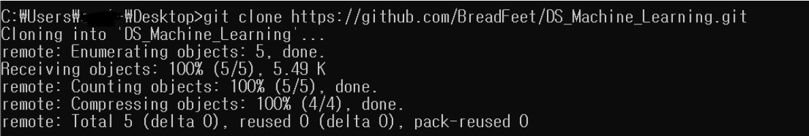

# Fork - Clone - Pull Request

> Github로 공동 프로젝트 할 수 있는 방법

> **Clone**: Github에서 좋은 자료나 데이터를 발견했을 때 권한에 관계없이 다운로드해서 사용할 수 있는 방법

<br>

1. 지정된 저장소를 `fork` 한다.

   * `fork`: 내 원격저장소로 가져오고 싶을 때

   <br>

2. 내 Github 계정으로 fork된 저장소를 로컬로 `clone` 한다.

   * `pull`: 이미 git이 생성된 로컬저장소에 원격저장소의 git을 가져올 때
   * `clone`: .git 포함 원격저장소 통째로 로컬저장소로 가져오고 싶을 때

   ```bash
   $ git clone <원격저장소 url>   # 로컬저장소를 만들 위치에서 bash 오픈
   ```

   <br>

3. 로컬에서 작업을 수행하고 저장한 뒤 add - commit을 진행한다.

<br>

4. Github 원격저장소로 push

<br>s

5. Github에 들어와서 Pull Request를 보내서 변경사항이 반영되도록 한다.

<br>

<br>

## Command Line으로 Clone 하는 방법

1. 윈도우 command prompt를 열고, 로컬 저장소를 만들 위치로 change directory를 한다.

   ```shell
   > cd [로컬 저장소 만들 위치]
   ```



<br>

2. `clone` command를 입력한다.

   ```shell
   > git clone [원격저장소 주소]
   ```


