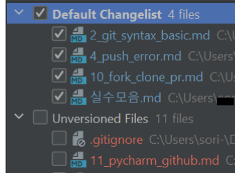
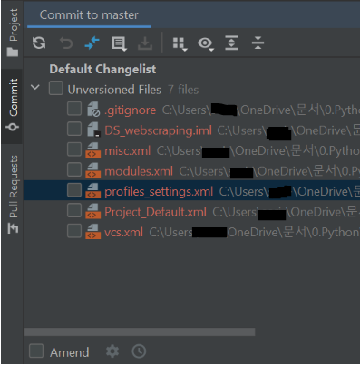

# PyCharm으로 Github 사용하기

## Git bash 보다 편리한 이유

1. git 명령어들을 직접 기입할 필요가 없다.
2. 일부 파일만 `add` 할 때, 길고 복잡한 파일명을 일일이 타이핑하지 않아도 된다.
3. `add`-`commit`-`push`를 한번에 할 수 있다.

## 사용 방법

1. 파이참에서 `.git`이 있는 폴더를 연다.

- 파이참 상단에서  해당 이미지가 뜬다.

- 원격저장소를 `clone` 해왔거나, 이미 `$ git init`을 수행한 폴더여야 한다.

2. `add` 되어야 하는 파일의 중, `commit`된 적 없는 파일 -> 빨간색 | `commit`된 적 있는 파일 -> 파란색

   

3. v 표시의 `commit` 아이콘을 클릭한 뒤, 커밋해야할 파일들을 체크박스에서 선택한다.

   

4. 그 아래 commit message를 작성하고 `commit and push` 버튼을 누른다.

- 파이참에서 처음으로 `push`를 진행하는 경우, 

  JetBrains와 Github을 연결하는 Authorization 과정 -> 로그인 과정을 거친다.

- `clone`된 저장소가 아닌 경우라면, 

  `define remote` -> 원격저장소 url 기입하는 과정을 거친다.

5. `push` 가 잘 이루어졌는지 확인하려면, Github에서 저장소를 새로고침 한다.

