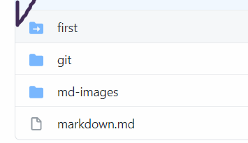
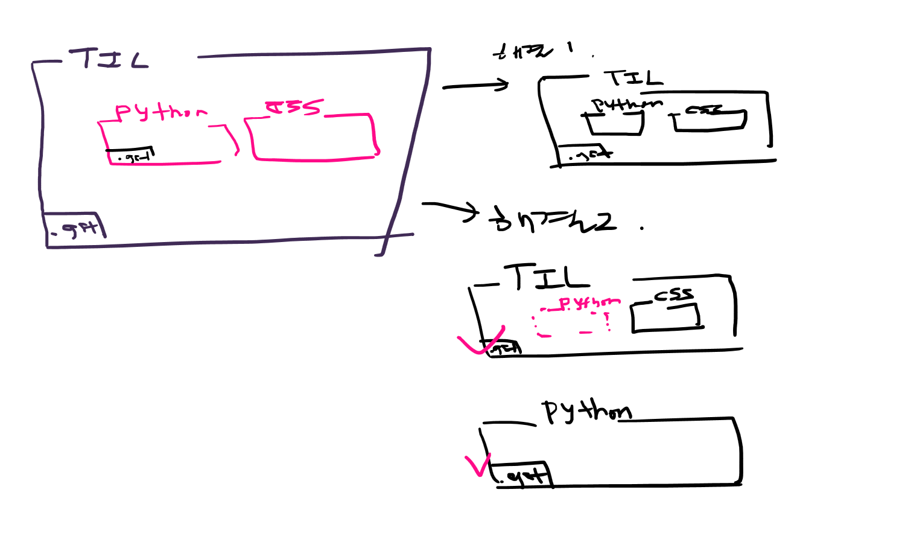
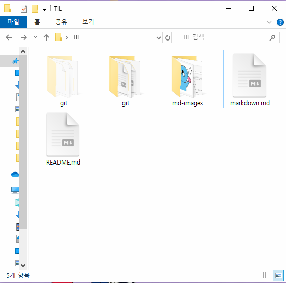
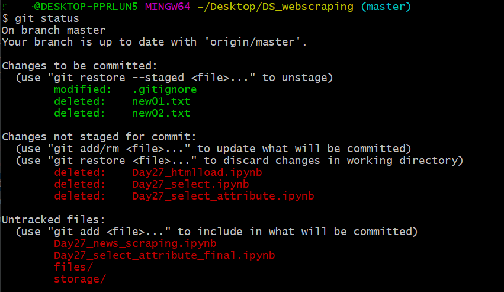
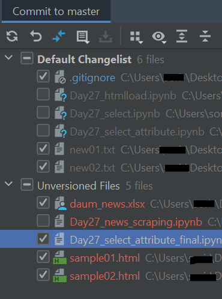

# 자주 하는 실수

## submodule => git 속 git



* 가끔 Github에 폴더에 화살표가 있을 때

  => Git 저장소 내부에 Git 저장소가 있는 경우  

* 솔루션 : submodule 형식으로 활용할 수는 있지만, 처음에는 복잡하게 가지말자!

  
  
  <br>

## 약속

* git bash here는 항상 .git 폴더가 있는 곳에서 하자!

* git 저장소로 활용되는 폴더에 다른 git 저장소를 옮기지 말자!


<br><br>

# 가능? 불가능?

### 1. TIL 폴더명 바꿔도 되나요? .git 의 상위폴더! 

### => 바꿔도됨! 전혀 상관 없음



* 폴더 이동도 자유롭게 해도 되지만, 항상 이동할 때 해당 폴더가 다른 git 저장소인지 체크는 할 필요가 있다!

* 프로젝트 폴더 이름이 바뀌는 것은 커밋과 상관이 없다.

  <br>

### 2. 원격저장소 이름이랑 로컬 폴더 이름은 같아야 할까요? => No!

원격저장소 이름이랑 로컬 폴더 이름은 전혀 상관이 없습니다.

그러면 상관이 있는 것은 무엇일까요?

```bash
$ git remote -v                   # 원격 저장소 정보 조회 
```

원격저장소 주소는 `clone` `pull` `push` 등의 명령어를 입력할 때 활용되는 것이지, 이름이 sync가 되어 있는 것은 아니다!

<br>

<br>

# 혼동하기 쉬운 부분

### 파일명을 바꾼 경우

> git은 파일명으로 기록하기 때문에, 기존 파일이 삭제되고 새로운 파일이 생성된 것으로 인식함

<br>

<Scenario 1>

1) md-images 폴더 이름을 md_images로 바꾸고 해당 폴더만 `add`-`commit`-`push`를 하였음

2) 원격저장소에 기존 md-images 폴더에 새로운 md_images 폴더까지 추가됨

   -> 새로운 폴더를 commit한 것과 같은 결과

   ==> 이 방법을 사용하면 하나의 파일 제목과 내용을 계속 수정하면서 Github에는 여러 파일로 `push` 가능

<br>

<b>* 결론</b> : "파일"을 `push`하는 것은 그 **파일 내용**의 생성, 변경을 기록하는 것

<br>

<br>

<Scenario 2>

1) md-images 폴더 이름을 md_images로 바꾸고 상위 폴더인 Git_notetakings 전체를 `add`-`commit`-`push` 

2) `$ git status`를 통해, Git_notetakings에서 일어난 `rename`, `deleted`된 모든 파일을 확인 가능함!

<br>

<b>* 결론</b> : "폴더"를 `push`하는 것은 그 **하위 파일**들의 생성, 변경, 삭제를 기록하는 것

<br>

<br>

# 폴더 내 변화 기록 중 일부만 push 하기

<Scenario 3>

1) Day27_A 파일을 Day27_B, Day27_C 등으로 이름과 내용을 바꾸어 `push`한 상태 

   -> Github에는 _A, _B, _C 모두 존재하지만, 로컬에는 더 이상 _A, _B 파일이 없음

2) 이외의 파일들도 수정한 뒤, 한번에 상위 폴더 DS_webscraping를 `add`-`commi`-`push`하려고 함

3) 생각해보니 로컬에서 `deleted`된 _A, _B의 기록이 모두 반영되어, Github에서도 지워지는 문제가 생김

<br>

### 삭제된 파일의 git 다루기

- 삭제된 파일의 이름을 이용해서 `deleted` 기록을 `add`-`commit` 가능



- 삭제된 기록 중에서도 일부만 반영할 수 있음

  → 위의 경우 일일이 파일 이름 `add`하는게 번거로워서 PyCharm이 유용함


